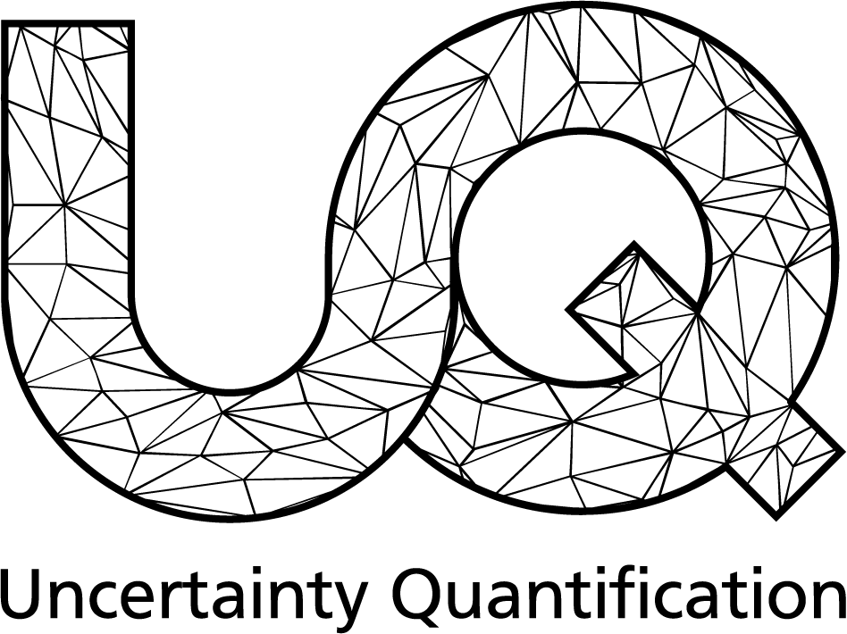

# Fimjax [](https://www.scc.kit.edu/forschung/uq.php)

Fimjax is a [JAX](https://jax.readthedocs.io/en/latest/)-accelerated iterative solver for anisotropic eikonal equations on regular triangulated meshes.
Non-triangulated meshes, i.e. tetrahedra or higher dimensions are not currently supported.
Based on a locally constant parameter tensor field $M$ and a set of in initial activation sites $\Gamma$ we compute the arrival times $u$ according to:

$$
\begin{gather*}
\sqrt{\big(\nabla u(\mathbf{x}),\mathbf{M}(\mathbf{x})\nabla u(\mathbf{x})\big)} = 1,\quad \mathbf{x}\in\Omega, \\
\nabla u(\mathbf{x}) \cdot \mathbf{n}(\mathbf{x}) \geq 0,\quad \mathbf{x}\in\partial\Omega, \\
u(\mathbf{x}_0) = u_0,\quad \mathbf{x}_0 \in \Gamma.
\end{gather*}
$$

The iterative solver uses a global Jacobi-Update, which can be easily parallelized on SIMD architectures, together with Godunov-type upwinding.

### Key Features
:material-checkbox-marked-circle-outline: &nbsp; **Supports anisotropic conductivity tensors** <br>
:material-checkbox-marked-circle-outline: &nbsp; **Works on irregular meshes** <br>
:material-checkbox-marked-circle-outline: &nbsp; **GPU offloading of performance-relevant computations** <br>
:material-checkbox-marked-circle-outline: &nbsp; **Parametric derivatives via algorithmic differentiation**

<br>

!!! tip "The JAX in Fimjax"
    Fimjax extensively uses the [JAX](https://jax.readthedocs.io/en/latest/) software library. This allows for JIT-Compilation and GPU offloading of performance critical code together with algorithmic differentiation.

## Installation and Development

Fimjax is currently not published as a package but can be installed as an editable install via

```
pip install -e <path-to-root>
```

## Documentation

#### Usage

Under Usage, we provide walkthroughs of the functionalities of Fimjax.
The [Forward Solver](usage/solve.md) tutorial explains in detail how to set up Fimjax for solving the Eikonal equation. [Parametric Derivatives](usage/derivatives.md) demonstrates how to differentiate the solver, given a computed forward solution.

#### API Reference

The API reference contains detailed explanations of all software components of Fimjax, and how to use them.

#### Examples

We provide [runnable examples](https://github.com/UQatKIT/fimjax/tree/main/snippets) in our Github repository.

## Acknowledgement and License

Fimjax is being developed in the research group [Uncertainty Quantification](https://www.scc.kit.edu/forschung/uq.php) at KIT.
It is partially based on the excellent [FIM-Python](https://fim-python.readthedocs.io/en/latest/) tool. Fimjax is distributed as free software under the [GNU Affero General Public License v3.0](https://choosealicense.com/licenses/agpl-3.0/)