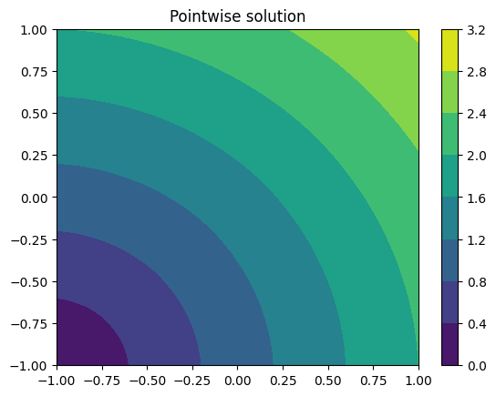

# Forwards solver

This example describes how to solve the Eikonal Equation on a simple 2D-Domain. 

## Mesh
```py
import numpy as np
from scipy.spatial import Delaunay

disc = np.linspace(-1, 1, 50)
X, Y = np.meshgrid(disc, disc)
points = np.stack([X, Y], axis=-1).reshape(-1, 2)
elements = Delaunay(points).simplices
```

Here points is a an array of shape ($50^2$, $2$) where each row corresponds to one point of the triangulation and elements is an array of shape ($N$, $3$) where each row contains three indices pointing into the points array, determining the three corners of a triangle.

Fimjax further provides a simple wrapper [`Mesh`][fimjax.util.datastructures.Mesh] that is used to pass these into Fimjax functions.

```py
from fimjax.util.datastructures import Mesh

mesh = Mesh(points=points, elements=elements)
```

Additionally we need a set of activation sites.
For simplicity we choose one corner as a starting point.

```py
from fimjax.util.datastructures import InitialValues

initial_values = InitialValues(locations=np.array([0]), values=np.array([0.]))
```

Lastly we need a metrics tensor, that characterizes the wave propagation at each triangle.
Here we use a isotropic constant tensor field $M(x) = I$.

```py
h = 1 * np.identity(2)
metrics = np.repeat(h[np.newaxis, :, :], mesh.elements.shape[0], axis=0)
```

Finally we can instantiate the solver:

```py
from fimjax.main import Solver

solver = Solver()
result = solver.solve(
    mesh=mesh,
    initial_values=initial_values, metrics=metrics, 
    iter=200
)
solution, iterations, has_converged, has_converged_after = result.values()
```

The solution dictionary contains additional information about the convergences. Since we use a fixed number of iterations it contains information on whether the solution has converged and after how many iterations it has converged. In the above example it only took 70 iterations for convergence.
The actual solution $u$ contains the values of $u$ at each vertex inside the mesh.
In the above example the resulting solution looks like this:

{width="700"}


